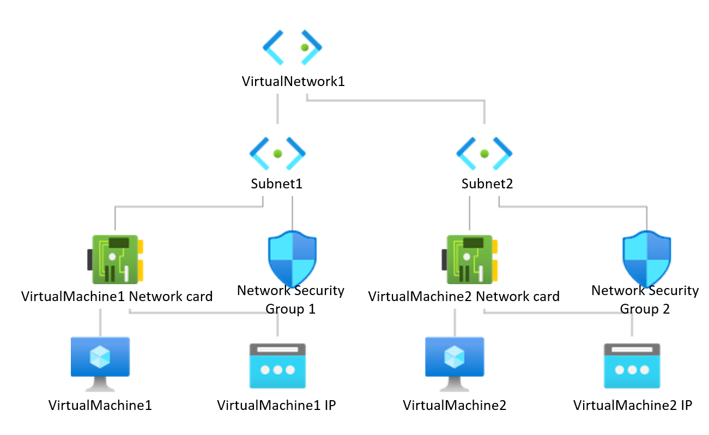
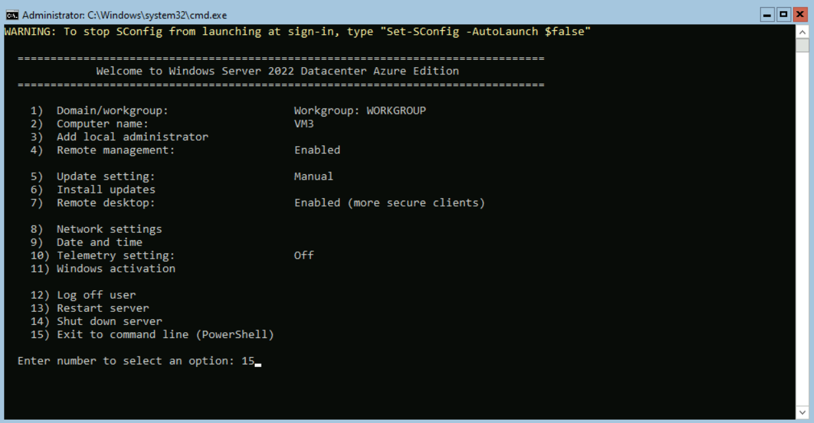
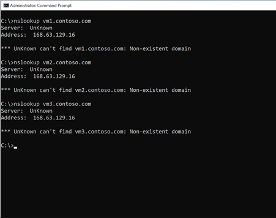
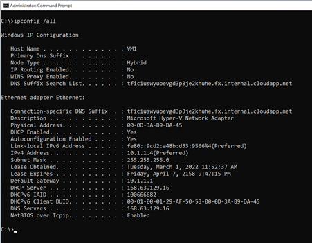
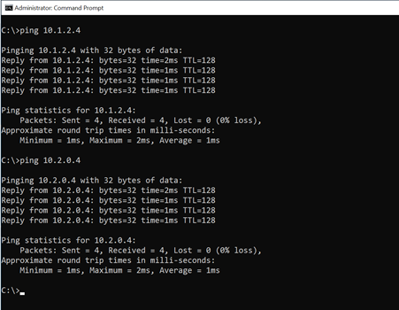
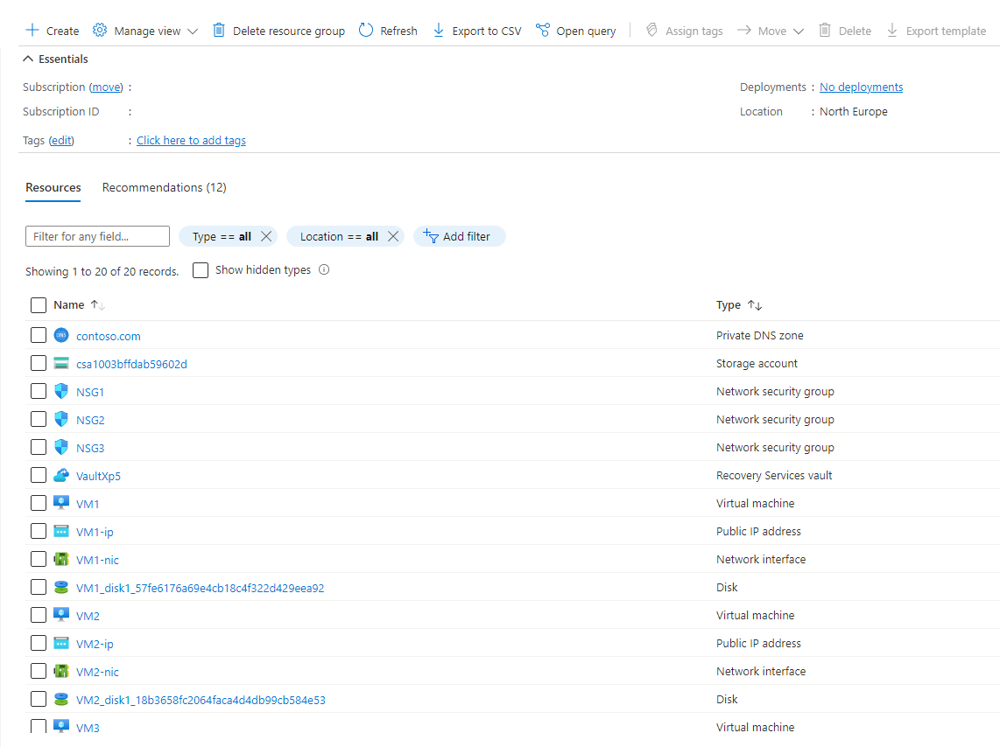
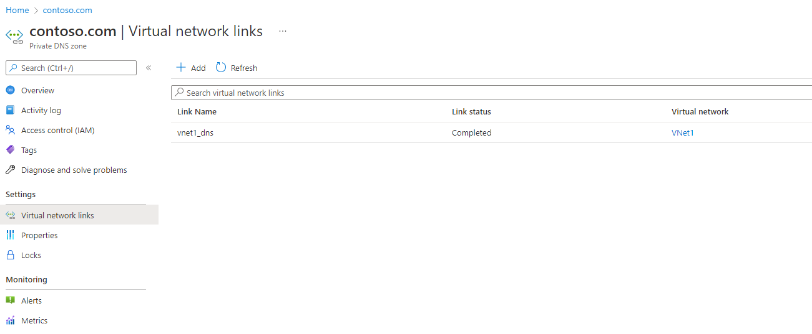
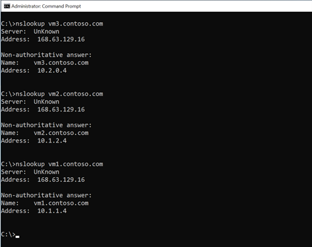

---
lab:
    title: 'Lab 2 - Name resolution issues'
    module: 'Troubleshoot name resolution issues in Microsoft Azure'
---

An Azure subscription is provided for this lab, see the credentials above. If you're interested in completing this lab using your own Azure subscription, sign up for a free trial at <https://azure.microsoft.com/free/>.


# Troubleshoot name resolution issues in Microsoft Azure

**Estimated Time: 15 minutes**

You work for Contoso as a network engineer, and users are complaining that they cannot access VM1 or VM2. You have configured two Azure virtual networks: VNet1 and VNet2. They are connected with peering.

| **Virtual network**| **IPv4 network address**| **Subnet**| **IPv4 network address**|
| :--- | :--- | :--- | :--- |
| VNet1| 10.1.0.0/16| Subnet1| 10.1.1.0/24|
||| Subnet2| 10.1.2.0/24|
| VNet2| 10.2.0.0/16| Default| 10.2.0.0/24|




| **Virtual machine**| **Operating system**| **VNet and subnet**| **DNS domain**|
| :--- | :--- | :--- | :--- |
| VM1| Windows Server 2019| VNet1, Subnet1| contoso.com|
| VM2| Windows Server 2019| VNet1, Subnet2| contoso.com|
| VM3| Windows Server 2019| VNet2, default| contoso.com|

## Diagnose networking issues between virtual machines

You'll connect to VM1 and VM3 using Azure Bastion and perform some networking checks.

1. Sign in to the [Azure portal](https://portal.azure.com) using the Azure credentials above or if you'd like your own Azure subscription.

1. Select the portal menu on the top left, select **Virtual machines**, and then select **VM1**.

    

1. On the **Overview** pane, select **Connect**, then select **Bastion**.
1. Select **Create Azure Bastion using defaults**.

    > [!note] It may take a few minutes to create the Bastion service. When it's created enter the below details.

1. Under **Connection Settings**, in Username, enter **AdminXyz**.
1. In Password, enter **Azur$Pa55w0rd**.
1. Select **Connect**, a new tab in your browser should connect to **VM1**.

    

1. In the command window, enter **15**.
1. Run this powershell command:

    ```powershell
    nslookup vm1.contoso.com
    ```

1. Run this powershell command:

    ```powershell
    nslookup vm2.contoso.com
    ```

1. Run this powershell command:

    ```powershell
    nslookup vm3.contoso.com
    ```

    

    The last command is unable to connect to **vm3.contoso.com**.

1. Switch back to the tab with the Azure portal, in the menu on the top left, select **Virtual machines**, and then select **VM3**.
1. On the **Overview** pane, select **Connect**, then select **Bastion**.
1. In Username, enter **AdminXyz**.
1. In Password, enter **Azur$Pa55w0rd**.
1. Select **Connect**, a new tab in your browser should connect to VM3.

1. In the command window, enter **15**.
1. Run this powershell command:

    ```powershell
    nslookup vm1.contoso.com
    ```

1. Run this powershell command:

    ```powershell
    nslookup vm2.contoso.com
    ```

1. Run this powershell command:

    ```powershell
    nslookup vm3.contoso.com
    ```

    

    VM3 is unable to find any of the domains. 

### Examine the Internet Protocol configuration of the Virtual Machines

The internal IP addresses of the virtual machines are:

- VM1 = 10.1.1.4

- VM2 = 10.1.2.4

- VM3 = 10.2.0.4

The DNS server address is 168.63.129.16, which is the wire server.



### Test network connectivity

Use **ping** to test network connectivity between the three virtual machines. Use the open Bastion tab for virtual machine VM1 try and try to ping the other two machines.

1. In the command window, run this command.

    ```powershell
    ping 10.1.2.4
    ```
1. Run this command.

    ```powershell
    ping 10.2.0.4
    ```

    If you ran these commands on the other machines you'd see that all three VMs are able to ping each other, so network connectivity is good at the IP level (OSI Layer 3).

    

### Examine the Azure resource group

There are two virtual networks (VNets) called **VNet1** and **VNet2**.

There is a private DNS zone, which is **contoso.com**.



The private DNS zone has vm1 and vm2 automatically registered, but vm3 does not appear.


Switch back to the Azure portal tab. 

1. Search for private dns zones, then select **contoso.com**.
1. Under **Settings**, select **Virtual network links**.

    

    Note that the private DNS zone is linked to **VNet1**, but not to **VNet2**.

## Resolve the connection issue

Your investigation points to a configuration issue with the private DNS zone.

### Link the private Domain Name System zone to Virtual Network 2

1. On the Virtual network links pane, select **+ Add** and enter these details:

    - Link name: vnet2_dns
    
    - [ ] I know the resource ID of virtual network – leave unchecked
    
    - Subscription: &lt;the name of your subscription&gt;
    
    - Virtual network: VNet2
    
    - Configuration: [&#10003;] Enable auto registration

1. Select **OK**.

    > [!note] It may take a few minutes for the link to be created. Select Refresh occasionally to see the latest status. Wait until the link status says Completed.

### Inspect the Domain Name System name table

Navigate to the Overview page and inspect the DNS name table.

VM1, VM2, and VM3 should appear. You may need to wait a short while for VM3 to appear. Select Refresh if necessary.

Nslookup on VM1 and VM2 should resolve vm3.contoso.com.

> [!tip] If VM3 does not appear after several minutes, try restarting the VM.


1. Switch back to the VM1 tab in your browser. 

1. Run this powershell command:

    ```powershell
    nslookup vm1.contoso.com
    ```

1. Run this powershell command:

    ```powershell
    nslookup vm2.contoso.com
    ```

1. Run this powershell command:

    ```powershell
    nslookup vm3.contoso.com
    ```



Optionally, you can test pinging each VM, using their DNS names.

- `ping vm1.contoso.com`

- `ping vm2.contoso.com`

- `ping vm3.contoso.com`

