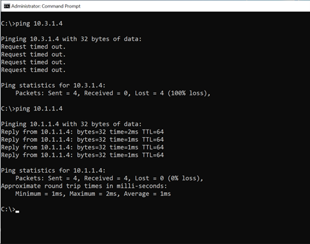
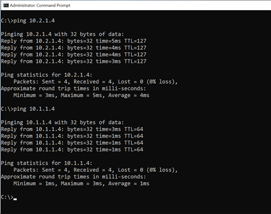

---
lab:
    title: 'Lab 3 - Troubleshoot cloud and hybrid connectivity'
    module: 'Troubleshoot cloud and hybrid connectivity in Microsoft Azure'
---

An Azure sandbox subscription is provided for this lab, see the credentials above. If you're interested in completing this lab using your own Azure subscription, sign up for a free trial at <https://azure.microsoft.com/free/>.

# Troubleshoot cloud and hybrid connectivity in Microsoft Azure

**Estimated Time: 10 minutes**

You've configured your network as shown in the diagram below. You want VM1 and VM2 to communicate via the VnetHub. Users are complaining that VM1 cannot communicate with VM2. You need to investigate to diagnose the problem, and then fix it.

There are three Azure virtual networks (VNets) in a hub and spoke topology.

## Verify the network topology

1. Sign in to the [Azure portal](https://portal.azure.com) using the Azure credentials above or if you'd like your own Azure subscription.

1. Select the portal menu on the top left, select **Resource groups**.

1. 

1. Familiarize yourself with the network topology and check it matches the diagram above.

1. Check the private IP addresses of the firewall (**FW1**) and virtual machines (**VM1** and **VM2**). These are allocated automatically.

1. Make a note of the correct IP addresses if they are different from the diagram.

### Check OSI level 3 connectivity

1. Connect to each virtual machine (VM1 and VM2) using Remote Desktop. Windows credentials are:

1. User name: AdminXyz

1. Password: sfr9jttzrjjeoem7hrf#

1. On VM1, open a command prompt window and ping the private IP address of VM2.

1. Ping the private IP address of the Azure firewall (FW1).

1. On VM2, open a command prompt window and ping the private IP address of VM1.

1. Ping the private IP address of the Azure firewall (FW1).

    

### Troubleshoot the problem

1. To understand what is causing the problem, try the following troubleshooting steps:

1. Examine ipconfig /all on both VM1 and VM2.

1. Examine the Network Security Groups, and routing tables.

1. Examine the firewall and the firewall rules.

1. Examine the peering connection properties.

    The diagram shows the effective routes on VM1-nic.

    

## Resolve the connection issue

When you examined the peering connections, you would have found that the peering settings are different.

| **VNet**| **Peering name**| **Traffic forwarded from remote virtual network**|
| :--- | :--- | :--- |
| VnetHub| Hub-Spoke1| Allow (default)|
| VnetHub| Hub-Spoke2| Block traffic that originates from outside this virtual network|
| VnetSpoke1| Spoke1-Hub| Allow (default)|
| VnetSpoke2| Spoke2-Hub| Block traffic that originates from outside this virtual network|

The settings on **Hub-Spoke2** are incorrect.

To fix the problem, you must change the setting in both sides of the peering between VnetHub and VnetSpoke2.

- Hub-Spoke2

- Spoke2-Hub

The **Traffic forwarded from remote virtual network** must be set to **Allow**.

It should now be possible on VM1 to ping VM2.

There will be a short delay before the new settings take effect. If the ping fails at first, try again.

