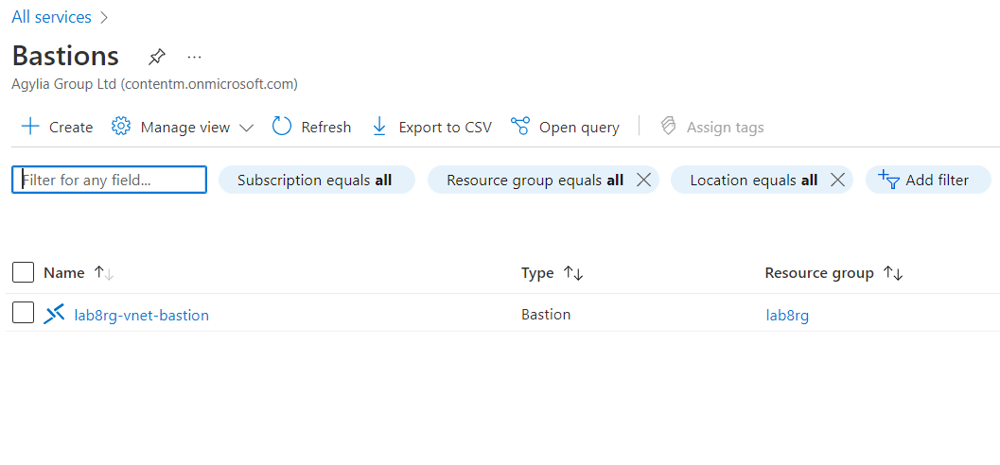
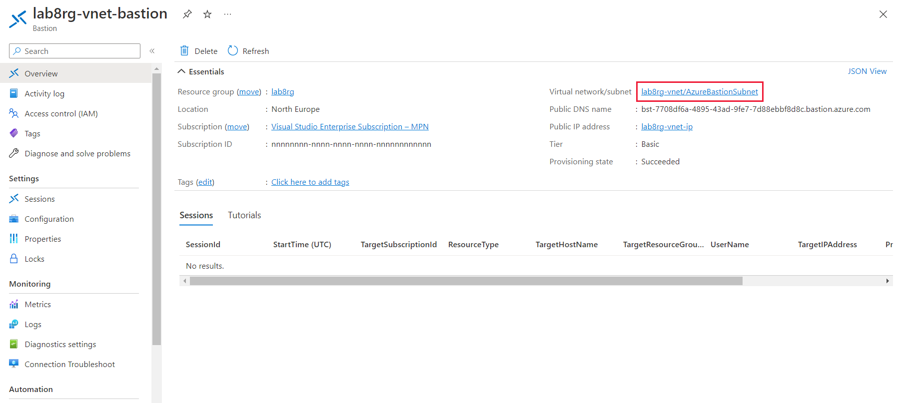
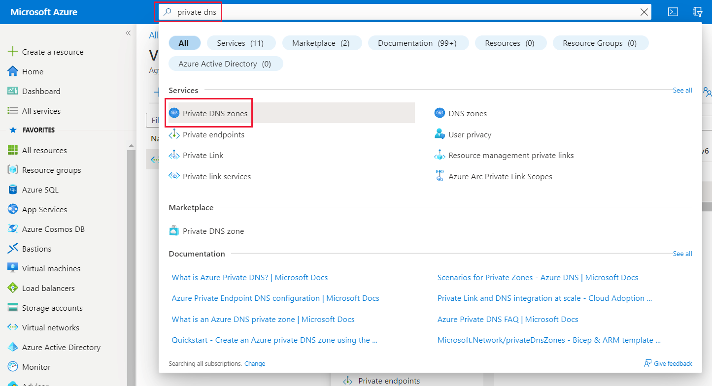
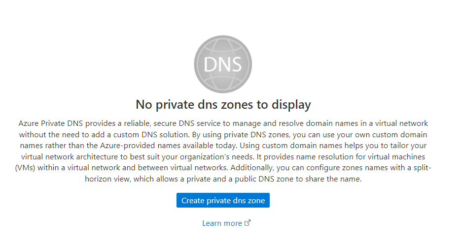
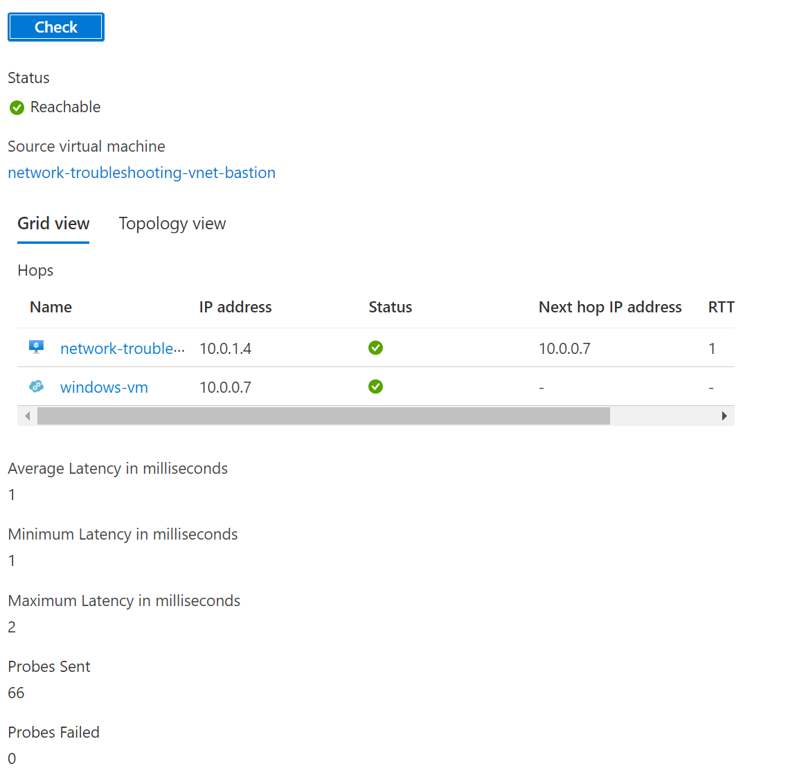
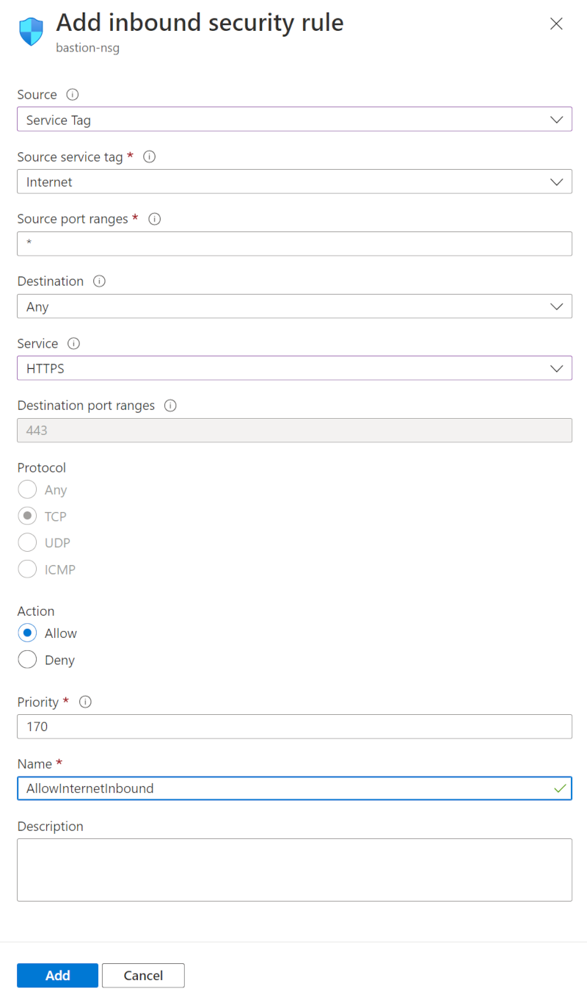
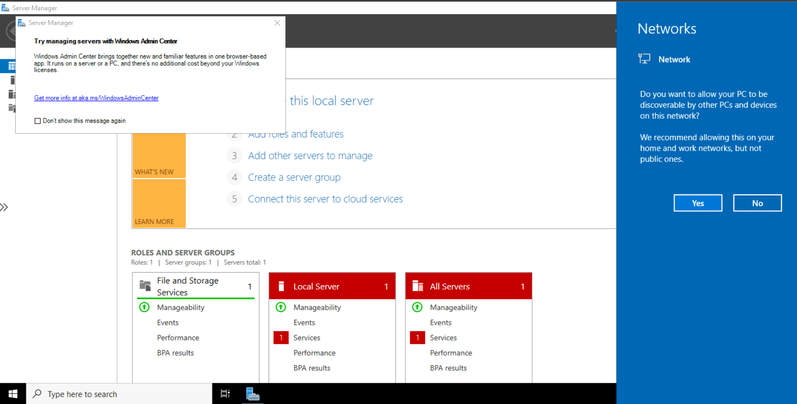

---
lab:
    title: 'Lab 8 - Troubleshoot connectivity issues with Azure Bastion'
    module: 'Troubleshoot connectivity issues with virtual machines in Microsoft Azure'
---

An Azure sandbox subscription is provided for this lab, see the credentials above. If you're interested in completing this lab using your own Azure subscription, sign up for a free trial at <https://azure.microsoft.com/free/>.

# Troubleshoot routing, traffic control and load balancing issues

**Estimated Time: 10 minutes**

You've been contacted by one of the teams you support. The team is having problems connecting to their VM using the Azure Bastion service.

In this lab, you'll see how to troubleshoot the Azure Bastion Service.

## Check that the issue still exists

1. Sign in to the [Azure portal](https://portal.azure.com) using the credentials above, or if you'd like your own Azure subscription.

1. Select the top left portal menu, select **Virtual machines**, then select **windows-vm**.

1. On the Overview pane, select **Connect**, then select **Bastion**.

1. In **Username**, enter **azureadmin**.

1. In **Password**, enter **Azur$Pa55w0rd**.

1. Select **Connect**.

Note that it takes time for the new tab to open, and when it does there's no response.

## Check that Bastion has been deployed

1. In the Azure portal, in the search box, type **Bastions**.

   

1. From the results, under **Services**, click **Bastions**.

1. You should see the Bastion service listed.

   

## Check if AzureBastionSubnet is using a Network Security Group correctly

1. In the Azure portal, in the search box, type **Bastions**.

1. From the results, under **Services**, click **Bastions**.

1. Select the Bastion you are troubleshooting.

   

1. In the top right, click the **Virtual network/subnet** link.

   

1. Under **Settings**, click **Subnets**, and then click **bastion-nsg**.

If Azure Bastion has a **Network security group** associated with the subnet, you need to check that it has all the inbound and outbound rules created. See the official Microsoft documentation, https://learn.microsoft.com/azure/bastion/bastion-nsg. Are there any rules missing?

## Check if there's a private DNS zone

1. In the Azure portal, in the search box, type **private dns**.

   

1. From the results, under **Services**, click **Private DNS zones**.

   

1. You shouldn't see any private DNS zones.

1. If there are any zones listed, check that they don't end in **azure.com** or **core.windows.net**.

   

## Run the Connection Troubleshoot tool to check for issues

1. In the Azure portal, in the search box, type **Bastions**.

1. From the results, under **Services**, click **Bastions**.

1. Select the Bastion you are troubleshooting.

1. Under **Monitoring**, click **Connection Troubleshoot**.

1. Under **Virtual machine**, select **windows-vm**.

1. Select your **Preferred IP Version**.

1. In the **Destination port**, if you want to use **RDP**, enter **3389**, if you want to use **SSH**, enter **22**.

1. Click **Check**.

    

1. The connection troubleshooter will show that the VM is reachable, even though it isn't.

    

## Resolve the bastion connection issue

After reviewing the bastion-nsg network security group you notice that there is a missing rule.

1. In the Azure portal, in the search box, type **Network security groups**.
1. Select **bastion-nsg**.
1. Select **Inbound security rules**.
1. Select **+ Add**.
1. In the fly out, enter these details:

    

    - Source: **Service Tag**
    - Source service tag: **Internet**
    - Service: **HTTPS**
    - Name: **AllowInternetInbound**

1. Select **Add**.

## Test the issue is resolved

1. Select the top left portal menu, select **Virtual machines**, then select **windows-vm**.

1. On the Overview pane, select **Connect**, then select **Bastion**.

1. In **Username**, enter **azureadmin**.

1. In **Password**, enter **Azur$Pa55w0rd**.

1. Select **Connect**.

    

    You should see a new tab open and connect to your VM.

You can watch the following video to see all the steps above:

> [!VIDEO https://www.microsoft.com/videoplayer/embed/RE4RYRS]
