# Troubleshoot site-to-site VPN gateway connectivity

**Estimated Time: 20 minutes**

As your organization's support engineer, you've been asked to help fix an issue between your resources in the US and northern Europe. you've existing infrastructure of virtual networks in two different regions. The VMs in the US virtual network (VNet1) are unable to get a ping response from the VMs in northern Europe (VNet2).

Checking the topology, you can see that there are VPN gateways and connections.

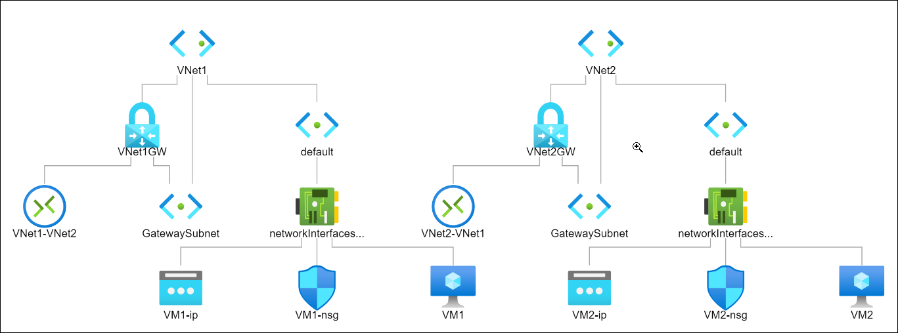

In this lab, you'll troubleshoot and resolve the connectivity issue.

## Task 1: Test the connection

We're going to test the connection between the two VMs, by sending a ping request between them.

1. From the Azure Portal, type **virtual machines** in the search bar and select **Virtual machines** under the Services.

   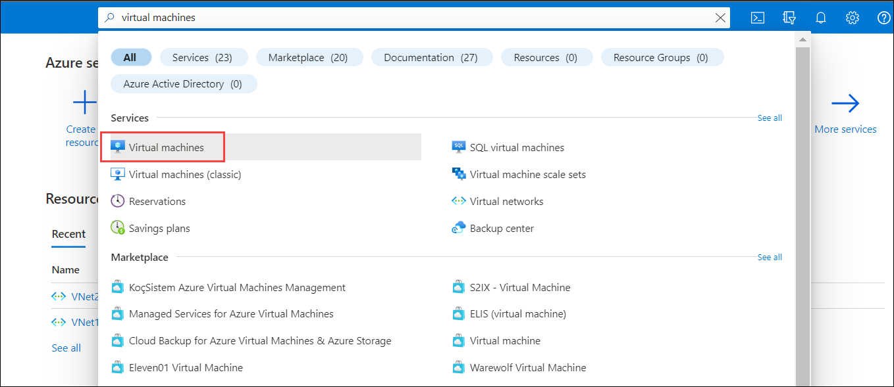

1. From the list of VMs, select **VM1-labrg08-<inject key="DeploymentID" enableCopy="false"/>**.

   

1. Make a note of the **Public IP address** and **Private IP address**.

   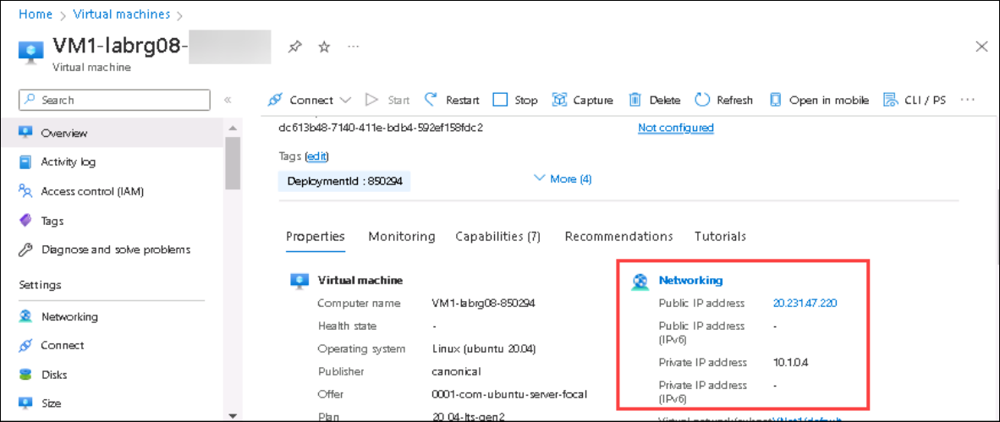

1. Repeat the last two steps for **VM2-labrg08-<inject key="DeploymentID" enableCopy="false"/>** and note the Public IP address and Private IP address.

1. Use the Azure Cloud Shell and SSH to connect to **VM1-labrg08-<inject key="DeploymentID" enableCopy="false"/>** using the public IP address:

   ```azurecli

   ssh azureuser@<VM1-public IP address>

   ```
   >**Note**:
   > Replace \<VM1-public IP address\> with the public IP address you noted for VM1-lab08rg-<inject key="DeploymentID" enableCopy="false"/>.

    
    
    >**Note**: If you are using Azure Cloud shell for the first time, Please follow below mentioned steps.
    
    1. Select **Bash** and if there is any pop-up to create storage, follow the below steps.

    1. Click on **Show advanced settings** and then provide the following details and click **Create Storage**

      * Resource group : Select **Use existing** -> **lab08-rg-<inject key="DeploymentID" enableCopy="false"/>**
      * Storage account : Select **Create new** and Enter **cloudstore<inject key="DeploymentID" enableCopy="false"/>**
      * File Share: Select **Create new** and Enter **blob**

1. At the prompt, ` Are you sure you want to continue connecting (yes/no)? ` type yes.

1. At the prompt for a password, type **azur3Pa55w.rd**.

1. Your prompt should change to `azureuser@VM1-labrg08-$DID :~$`.($DID will be your Deployment ID in the Environment Detals Page)

1. This means you've successfully connected to **VM1-labrg08-<inject key="DeploymentID" enableCopy="false"/>**.

1. Ping the private IP address of **VM2-labrg08-<inject key="DeploymentID" enableCopy="false"/>**.

   ```bash
   ping <private IP address VM2>

   ```

   >**Note**:
   > Replace \<private IP address VM2\>  with the private IP address you noted for VM2-labrg08-<inject key="DeploymentID" enableCopy="false"/>. 

   

1. We can confirm that the two machines can't connect, as there is no response from **VM2-lab08rg-<inject key="DeploymentID" enableCopy="false"/>**.

1. Press **CTRL** + **C** keys to quit the ping command.

## Task 2: Troubleshoot the gateways

You'll check the types are correct for both gateways.

1. On the Azure portal, in the search bar, type **virtual network gateways**, and then select the service to continue.

   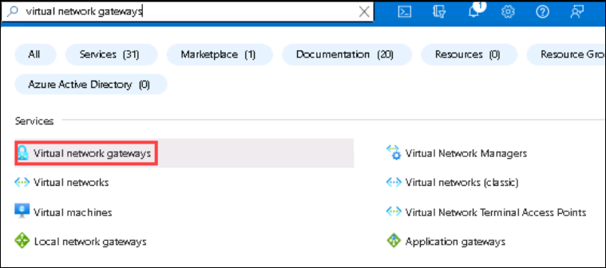

1. Select **VNet1GW**.

   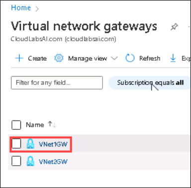

1. Confirm that the VPN type is route-based, and the gateway type is VPN.

   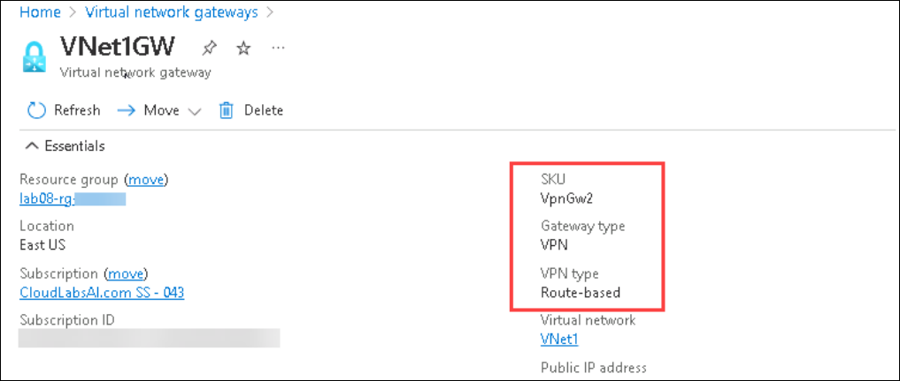

1. Scroll down the page to check the tunnel Ingress and Egress. Can you see a time when something might have happened to cause a problem?

   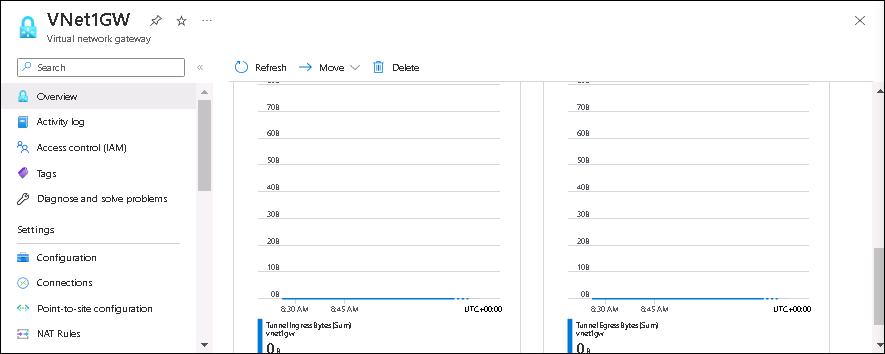

1. Repeat for VNet2GW.

## Task 3: Troubleshoot the virtual networks

You'll now check the address spaces don't overlap for the two virtual networks.

1. In the search bar, type **virtual networks**, and then select the **Virtual network** service.

1. Select **VNet1** which belongs to lab08-rg-<inject key="DeploymentID" enableCopy="false"/> resource group.

   

1. Make a note of the **Address space**.

   

1. Select **VNet2** which belongs to lab08-rg-<inject key="DeploymentID" enableCopy="false"/> resource group, and check that the address spaces do not overlap.

   

1. The two address spaces are different, so we can rule out any problems with them.

1. You'll now check the subnets are correctly set up.

1. Select **VNet1**, then select **Subnets**.

1. Check the **subnet address** is a subset of the **address space**.

1. Repeat for **VNet2**.

   

1. The **GatewaySubnet** addresses have been correctly created and correspond with the default range.

## Task 4: Check the gateway connections

1. In the search bar, type virtual network gateway and then select **virtual network gateways**.

1. The two gateways will be displayed.

1. Select **VNet1GW**.

   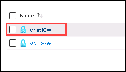

1. Select **Connections**.

   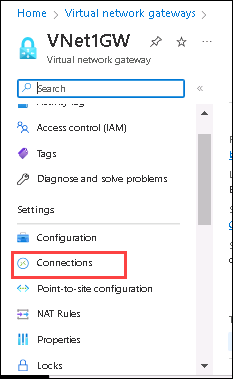

1. The issue seems to be with the connections between the gateways.

   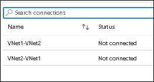

1. Select **Refresh** to check that there is still an issue with connection.

   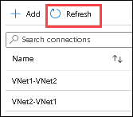

1. A connection still can't be made, so you'll check the shared keys.

1. Select **VNet1-VNet2**.

1. Select **Shared key** under settings.

1. Make a note of the **Shared key**.

   

1. Navigate back to **VNet1GW**,Select **Connections** then select **VNet2-VNet1**.

1. Select **Shared key** under settings.

   

1. The shared keys are not the same. For the connections to work, the shared key must be identical.

You've explored the possible reasons why your two machines can't connect to each other. You found that the shared key for the two connections is different.

You'll change the shared key on a VPN gateway connection to resolve the issue.

## Task 5: Change a gateway connection's shared key

Follow these steps to check the shared key for both the VPN gateways connections:

1. In the Azure portal, search for **virtual network gateways**, then under **Services**, select **Virtual network gateways**.

   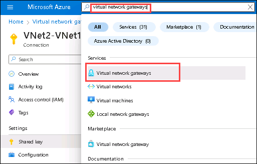

1. Select the first VPN gateway, **Vnet1GW**.

1. Under Settings, select **Connections**.

   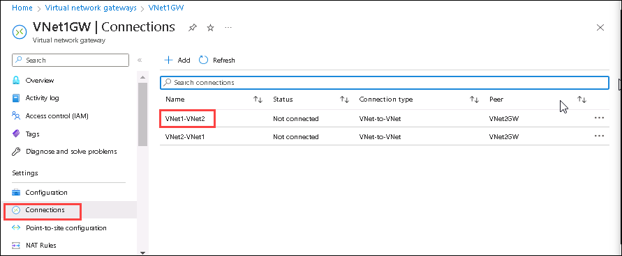

1. Select the first connection, **VNet1-VNet2**.

1. Under Settings, select **Shared key**.

   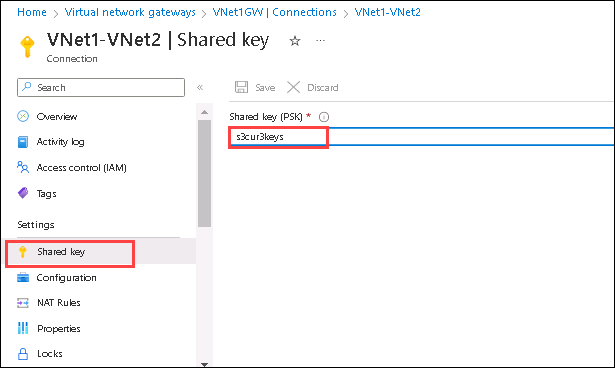

1. Copy the text in the **Shared key (PSK)**.

1. Navigate back to **VNet1GW**,then Select **Connections**

1. Select the second connection, **VNet2-VNet1**.

   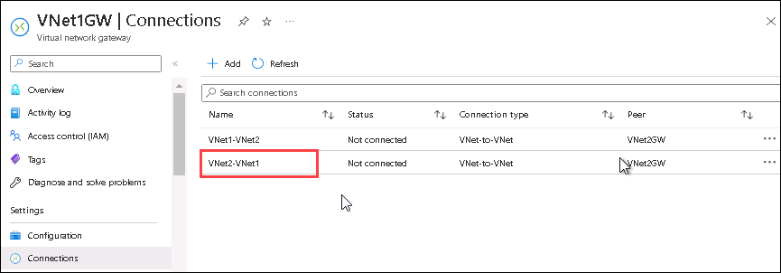

1. Under Settings, select **Shared key**.

1. Paste the value you copied into the **Shared key (PSK)** and click on **Save**. This is to make sure that the values match.

## Task 6: Test the issue is resolved

Repeat the steps you did in the previous exercise to see if the two VMs can connect to each other. Using the Cloud Shell on the right and the Azure portal, follow these steps:

1. Search for **virtual machines** then, under Services, select **Virtual machines**.

   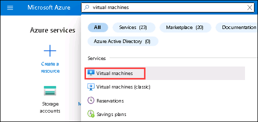

1. From the list of VMs, select **VM1-lab08rg-<inject key="DeploymentID" enableCopy="false"/>**.

   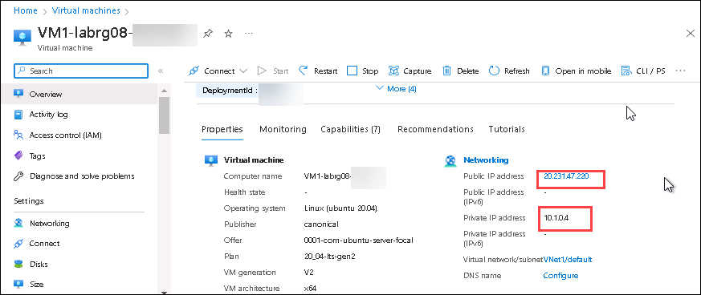

1. Make a note of the Public IP address and Private IP address.

1. Repeat the last two steps for **VM2-labrg08-<inject key="DeploymentID" enableCopy="false"/>** and note the Public IP address and Private IP address.

1. On the right, in the Cloud Shell, connect to VM1 with SSH to the public IP address:

   ```azurecli

   ssh azureuser@<VM1-public IP address>

   ```

   >**Note**:
   > Replace \<VM1-public IP address\>; with the public IP address you noted for VM1-labrg08-<inject key="DeploymentID" enableCopy="false"/> in task 1, Step 4

1. At the prompt for a password, type **azur3Pa55w.rd**.

1. Your prompt should now be `azureuser@VM1-labrg08-<inject key="DeploymentID" enableCopy="false"/>:~$`.

1. This means you have successfully connected to VM1-labrg08-<inject key="DeploymentID" enableCopy="false"/>.

1. Ping the private IP address of VM2-labrg08-<inject key="DeploymentID" enableCopy="false"/>

   ```

   ping <private IP address VM2>

   ```

   >**Note**
   > Replace \<private IP address VM2\>; with the private IP address you noted for VM2-labrg08-<inject key="DeploymentID" enableCopy="false"/>.

   

1. If you have resolved the connection issue, you should see a response from VM2-labrg08-<inject key="DeploymentID" enableCopy="false"/>.

1. Press **CTRL** + **C** keys to quit the ping command.
